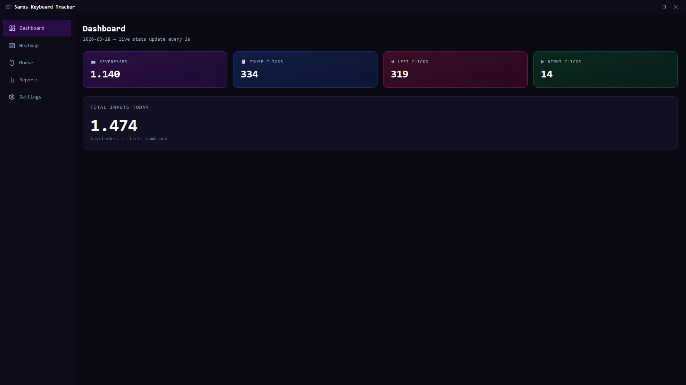
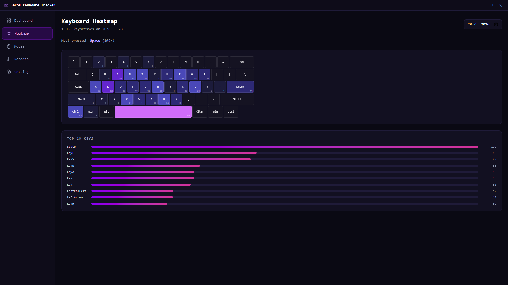
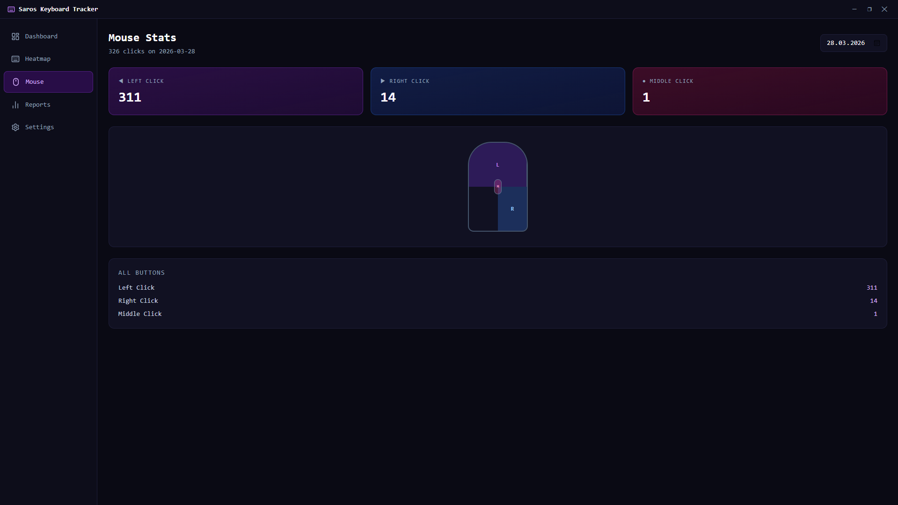
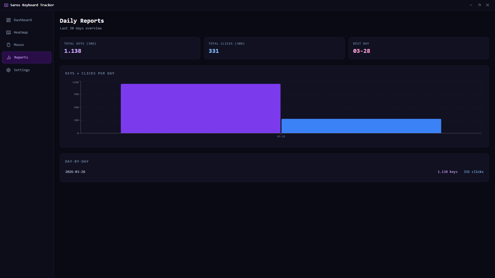
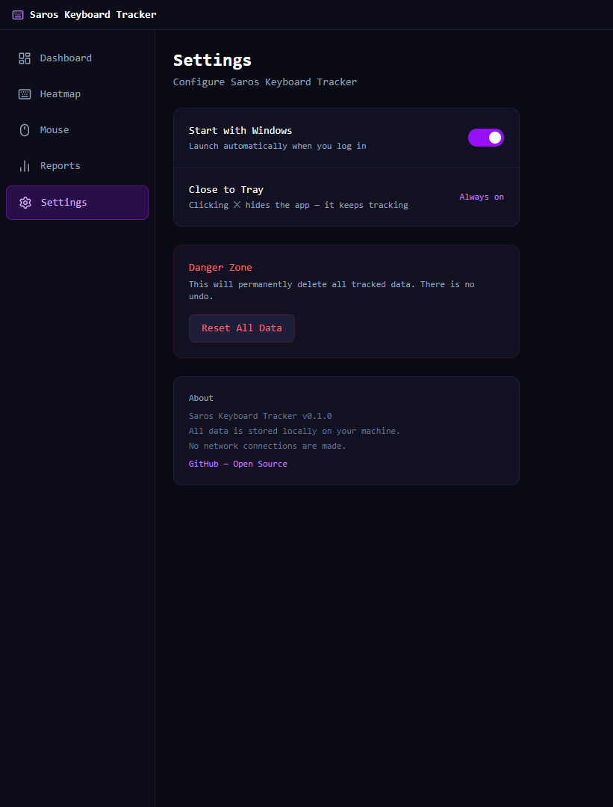

# Saros Keyboard Tracker

A lightweight, privacy-first Windows 11 app that counts every keypress and mouse click — giving you beautiful daily reports and a glowing keyboard heatmap.

> All data is stored **100% locally**. No telemetry, no network calls.

---

## Features

- **Global Tracking** — counts all keyboard and mouse button presses, even when the app is in the background
- **System Tray** — closing the window hides to tray; the tracker keeps running silently
- **Autostart** — optionally launch with Windows, fully configurable in Settings
- **Keyboard Heatmap** — full QWERTY layout that glows brighter for frequently pressed keys
- **Mouse Stats** — left, right, and middle click counters with a visual mouse diagram
- **Daily Reports** — bar chart overview of the last 30 days + per-day breakdown
- **Gaming Dark UI** — deep dark theme with neon purple/blue accents
- **Single `.exe` installer** — no setup complexity, installs per-user

---

## Screenshots

| Dashboard | Heatmap |
|:---------:|:-------:|
|  |  |

| Mouse Stats | Daily Reports |
|:-----------:|:-------------:|
|  |  |

| Settings |
|:--------:|
|  |

---

## Installation

Download the latest `.exe` installer from the [Releases](../../releases) page and run it.

Requires **Windows 10/11** (x64). No additional runtime needed.

---

## Build from Source

**Prerequisites:**
- [Rust](https://rustup.rs/) (stable)
- [Node.js](https://nodejs.org/) 18+
- [VS Build Tools](https://visualstudio.microsoft.com/visual-cpp-build-tools/) (C++ workload)

```bash
# Clone the repo
git clone https://github.com/Sarocesch/saros-keyboard-tracker
cd saros-keyboard-tracker

# Install frontend dependencies
npm install

# Run in development mode
npm run tauri dev

# Build release .exe
npm run tauri build
# Output: src-tauri/target/release/bundle/nsis/*.exe
```

---

## Releasing

Push a version tag to trigger a GitHub Actions build:

```bash
git tag v0.1.0
git push origin v0.1.0
```

The workflow builds a Windows `.exe` installer and attaches it to a GitHub Release automatically.

---

## Privacy

- All data is stored in `%APPDATA%\com.sarocesch.keyboard-tracker\saros_tracker.db` (SQLite)
- The app makes **zero network requests**
- No analytics, no crash reporting, no external services

---

## Tech Stack

| Layer    | Technology                          |
|----------|-------------------------------------|
| App      | [Tauri 2.0](https://tauri.app)      |
| Backend  | Rust + rusqlite + rdev              |
| Frontend | React 19 + TypeScript + Vite        |
| Styling  | Tailwind CSS v4                     |
| Charts   | Recharts                            |
| DB       | SQLite (bundled, WAL mode)          |

---

## License

Apache 2.0 — see [LICENSE](LICENSE)

---

## Contributing

PRs and issues are welcome! See [CONTRIBUTING.md](CONTRIBUTING.md) for details.
